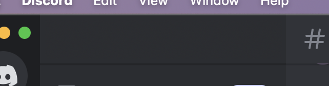

# Redact, a censor bar for your computer
Redact creates an interactive censor bar for your screen. It can be moved, resized and switched between various styles - one of which infers a suitable camouflage based on surrounding pixels. It is written in python and care is taken to make it work on all platforms.
## Usage

> *Redact in action censoring the name of a discord server. Camouflage is engaged.*

Controls:
- Right click to cycle between black, white and camouflage
- Drag the right or bottom sides to resize
- Drag anywhere else to move
- Click the top left to close
- Drag from the top left to make another censor.
- Click on the window and hover for a few seconds to show a tooltip that tells you these controls.

## Installation
#### Debian
1. Install the needed dependencies:
```bash
sudo apt-get install wxpython-tools
pip3 -v install mss
```
3. Clone this repo
```bash
git clone https://github.com/lomnom/Redact
cd Redact
```
4. Run with `python3 Censor.py`
3. Install Redact to ~/.local and create an entry in Applications.
```bash
cd .. # If you start in the Redact directory
mv Redact ~/.local/ # Note: Delete this file if it is not your first time installing.
echo "[Desktop Entry]
Type=Application
Name=Redact
GenericName=Utiliy
Icon=$HOME/.local/Redact/Icon.ico
Exec=/usr/bin/python3 $HOME/.local/Redact/Censor.py
Terminal=false
Categories=Utilities;" > ~/.local/share/applications/Redact.desktop
```

#### MacOS
##### Download
A `.dmg` binary release is available here: https://github.com/lomnom/Redact/releases
##### From source
1. Have python3 installed
2. Install the needed dependencies:
```bash 
pip3 install wxPython mss
```
3. Clone this repo
```bash
git clone https://github.com/lomnom/Redact
cd Redact
```
4. Run with `python3 Censor.py`
